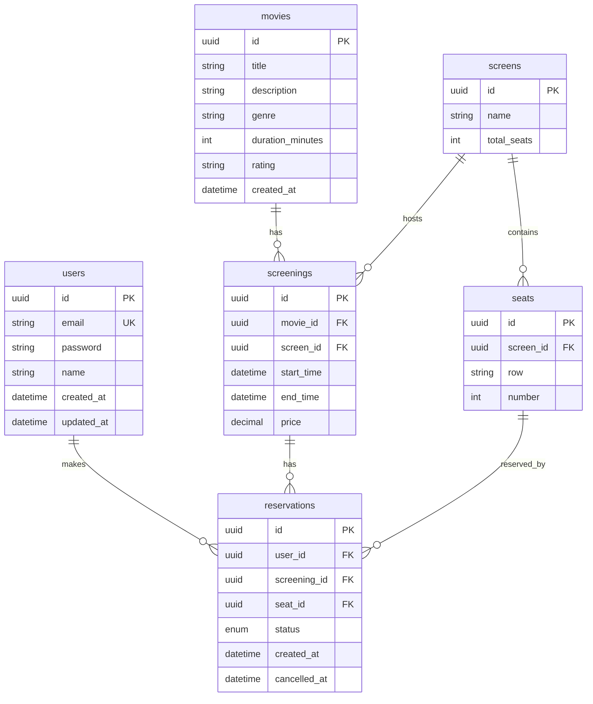

# 영화 티켓 예매 시스템

영화 상영 정보 조회, 좌석 선택 및 예매, 예매 내역 관리 기능을 제공하는 풀스택 웹 애플리케이션입니다.

## 기술 스택

| 레이어 | 기술 |
|--------|------|
| Backend | NestJS, TypeScript |
| Database | PostgreSQL |
| ORM | Prisma |
| Auth | JWT (Access Token) |
| API Docs | Swagger |
| Frontend | Next.js (App Router), Tailwind CSS |
| Infra | Docker, docker-compose |
| Test | Jest (유닛 20개 + E2E 16개) |

## 실행 방법

### Docker Compose (권장)

```bash
docker-compose up -d
```

컨테이너 시작 시 마이그레이션과 시드 데이터 주입이 **자동으로** 실행됩니다.

| 서비스 | 주소 |
|--------|------|
| 프론트엔드 | http://localhost:3001 |
| 백엔드 API | http://localhost:3000 |
| Swagger UI | http://localhost:3000/api/docs |

### 로컬 실행

```bash
# 1. PostgreSQL 실행
docker-compose up -d postgres

# 2. 백엔드
cd backend
cp .env.example .env
npm install
npx prisma migrate dev
npx prisma db seed
npm run start:dev

# 3. 프론트엔드 (별도 터미널)
cd frontend
npm install
npm run dev
```

### 테스트

```bash
cd backend
npm run test        # 유닛 테스트 (20개)
npm run test:e2e    # E2E 테스트 (16개)
```

## 프로젝트 구조

```
├── backend/
│   ├── src/
│   │   ├── auth/           # 회원가입, 로그인 (JWT)
│   │   ├── movie/          # 영화 목록/상세 조회
│   │   ├── screening/      # 상영 시간표, 좌석 현황
│   │   ├── reservation/    # 예매, 조회, 취소
│   │   ├── prisma/         # DB 연결 모듈
│   │   └── common/         # Guard, Decorator, Filter
│   ├── prisma/
│   │   ├── schema.prisma   # DB 스키마
│   │   └── seed.ts         # 시드 데이터 (영화 7편, 상영 42개)
│   └── test/               # E2E 테스트
├── frontend/
│   └── src/
│       ├── app/            # Next.js 페이지
│       ├── lib/            # API 클라이언트, 인증 Context
│       └── components/     # 공통 컴포넌트 (Navbar)
└── docker-compose.yml
```

## API 엔드포인트

| Method | Endpoint | 설명 | Auth |
|--------|----------|------|------|
| POST | /api/auth/signup | 회원가입 | - |
| POST | /api/auth/login | 로그인 | - |
| GET | /api/movies | 영화 목록 조회 | - |
| GET | /api/movies/:id | 영화 상세 조회 | - |
| GET | /api/movies/:movieId/screenings | 상영 시간표 조회 | - |
| GET | /api/screenings/:id/seats | 좌석 현황 조회 (예매 여부 포함) | - |
| POST | /api/reservations | 좌석 예매 | O |
| GET | /api/reservations | 내 예매 내역 | O |
| PATCH | /api/reservations/:id/cancel | 예매 취소 | O |

## ERD



> **핵심 제약**: `reservations` 테이블에 `(screening_id, seat_id) WHERE status='CONFIRMED'` 조건의 Partial Unique Index 적용 → 동시 예매 중복 방지의 최종 안전장치

## 설계 의도

### NestJS 선정
모듈 기반 아키텍처로 도메인별 관심사 분리가 명확합니다. 의료 도메인의 실무 환경에서 사용할 법한 구조화된 프레임워크를 선택했습니다.

### Prisma 선정
타입 안전한 쿼리 빌더와 직관적인 스키마 정의로 생산성과 안정성을 확보합니다. 자동 마이그레이션과 시드 기능도 활용합니다.

### Next.js 프론트엔드
면접관이 Swagger 없이도 바로 전체 플로우를 시연할 수 있도록 최소한의 UI를 제공합니다.

## 고려한 사항

### 좌석 예매 동시성 제어
- **2단계 방어 전략**으로 동시성 문제를 해결합니다.
  1. **서비스 레이어 (빠른 피드백)**: Prisma `$transaction` 내에서 `status = CONFIRMED` 예매 존재 여부를 먼저 확인하여 대부분의 중복 요청을 즉시 차단합니다.
  2. **DB 레벨 (최종 안전장치)**: `(screening_id, seat_id) WHERE status='CONFIRMED'` 조건의 PostgreSQL Partial Unique Index를 적용하여, 동시 요청이 서비스 레이어 체크를 동시에 통과하더라도 INSERT 시점에 DB가 중복을 거부합니다.
- Prisma의 P2002 에러(Unique Constraint Violation)를 catch하여 409 ConflictException으로 변환합니다.
- `CANCELLED` 상태는 Partial Index에서 제외되므로, 취소 후 동일 좌석 재예매가 정상적으로 허용됩니다.

### 데이터 무결성
- 외래키 제약조건으로 참조 무결성을 보장합니다.
- 과거 상영에 대한 예매를 서비스 레이어에서 차단합니다.
- 좌석의 상영관 소속 여부를 검증하여 잘못된 좌석 예매를 방지합니다.

### 인증
- bcrypt로 비밀번호를 해시하여 저장합니다.
- JWT Access Token 기반 인증으로, 예매/조회/취소 API를 보호합니다.

### 확장 가능성
- **다중 좌석 동시 예매**: 현재는 1회 요청당 1좌석 예매 방식입니다. `seatIds[]` 배열 수신 후 트랜잭션 내 일괄 처리로 확장 가능합니다.
- **Redis**: 좌석 임시 잠금(TTL 기반)이나 세션 캐싱에 활용할 수 있습니다.
- **Kafka**: 이벤트 기반 아키텍처로 알림, 결제 등 후속 처리를 분리할 수 있습니다.

## 시드 데이터

`docker-compose up` 또는 `npx prisma db seed` 실행 시 다음 데이터가 자동 생성됩니다:

| 데이터 | 내용 |
|--------|------|
| 영화 | 7편 (인터스텔라, 범죄도시 4, 인사이드 아웃 2, 파묘, 듄: 파트 2, 소년시절의 너, 위키드) |
| 상영관 | 3개 (1관 80석, 2관 60석, 3관 40석) |
| 상영 시간표 | 42개 (내일부터 3일간, 영화 7편 전체 배정) |
